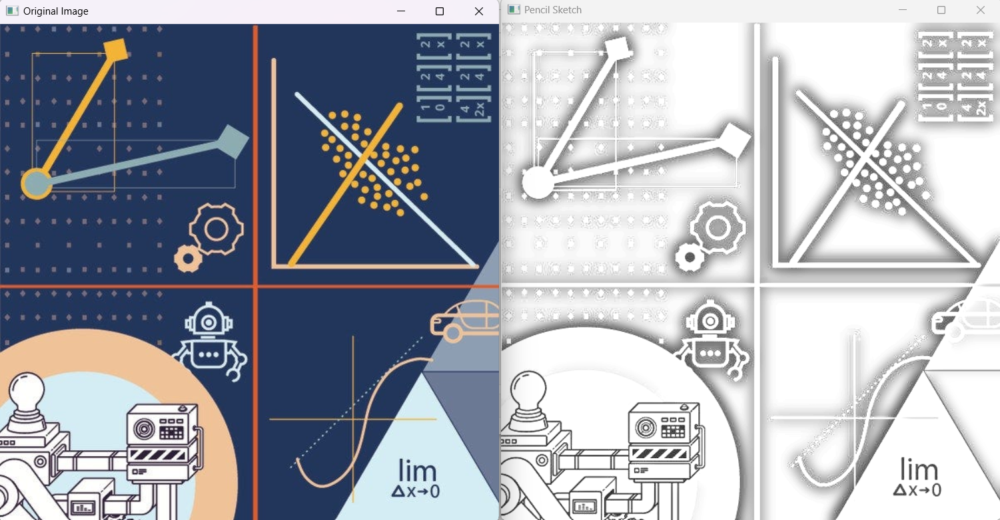
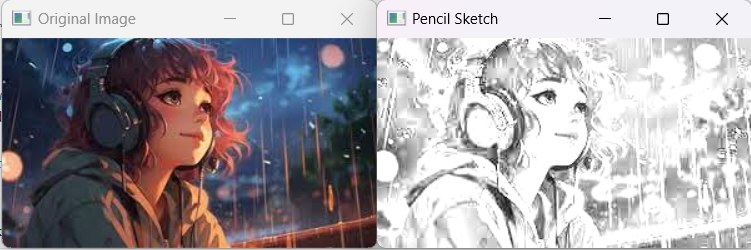

# Pencil Sketch Module

This Python module converts an RGB image into a pencil sketch using OpenCV.

## Installation

You can clone this repository to your local machine using Git. Open a terminal and run the following command:
```sh
git clone https://github.com/rsrujana/pencil-sketch.git
```

## Dependencies

To use this module, you need to have OpenCV pre-installed. You can install it using pip:

```sh
pip install opencv-python
```

## Usage

After the setup is ready, you are set to use the module on any image you want as such:

```python
from pencil_sketch import pencil_sketch

sketch = pencil_sketch(r"path/to/your/image.jpg")
cv2.imshow('Pencil Sketch', sketch)
cv2.waitKey(0)
cv2.destroyAllWindows()
```

> [!NOTE]
>
>- Replace "path/to/your/image.jpg" with the path to your RGB image file.
>- Make sure to append 'r' before path string as below.
>- Otherwise, based on the OS, file paths 1st characters can be considered as special characters.\
Eg: "./new" can be treated as `/n` new line

## Output





## License

This project is licensed under the MIT License - see the LICENSE file for details.
